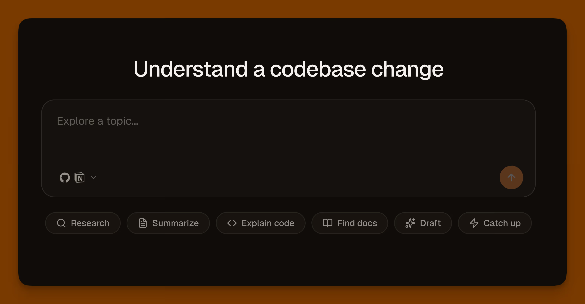

# Claude Managed Agents Template

An internal knowledge agent built with [Claude Managed Agents](https://platform.claude.com/docs/en/managed-agents/overview). Connect your GitHub, Notion, and Slack via MCP and ask questions across all of them. Read more in the [guide](https://vercel.com/kb/guide/claude-managed-agent-vercel).

[](https://vercel.com/new/clone?repository-url=https%3A%2F%2Fgithub.com%2Fvercel-labs%2Fclaude-managed-agents-starter&project-name=claude-managed-agents&repository-name=claude-managed-agents&env=ANTHROPIC_API_KEY%2CANTHROPIC_AGENT_ID%2CANTHROPIC_ENVIRONMENT_ID%2CBETTER_AUTH_SECRET%2CVERCEL_CLIENT_ID%2CVERCEL_CLIENT_SECRET%2CTOKEN_ENCRYPTION_KEY&envDescription=Configure+your+Anthropic+agent+and+Vercel+OAuth+credentials.&envLink=https%3A%2F%2Fgithub.com%2Fvercel-labs%2Fclaude-managed-agents-starter%23environment-variables&products=%5B%7B%22type%22%3A%22integration%22%2C%22protocol%22%3A%22storage%22%2C%22productSlug%22%3A%22neon%22%2C%22integrationSlug%22%3A%22neon%22%7D%5D&demo-title=Internal+Knowledge+Agent&demo-description=An+internal+knowledge+assistant+powered+by+Claude+Managed+Agents.+Connect+GitHub%2C+Notion%2C+and+Slack+via+MCP+to+search+across+your+tools.)



## Stack

| Layer | Choice |
| --- | --- |
| App | [Next.js 16](https://nextjs.org) (App Router), React 19 |
| UI | [shadcn/ui](https://ui.shadcn.com), Tailwind CSS v4 |
| Auth | [Better Auth](https://www.better-auth.com) + [Sign in with Vercel](https://vercel.com/docs/sign-in-with-vercel/getting-started) |
| Data | [Neon](https://neon.tech) + [Drizzle ORM](https://orm.drizzle.team) |
| Background | [Workflow SDK](https://useworkflow.dev) |
| Agents | [Claude Managed Agents](https://platform.claude.com/docs/en/managed-agents/overview) via `@anthropic-ai/sdk` |

## Quickstart

### 1. Clone, install skills, and provision integrations

```bash
git clone https://github.com/vercel-labs/claude-managed-agents.git
cd claude-managed-agents
npx skills add anthropics/skills --skill claude-api
npx skills add vercel/workflow
vercel link
vercel integration add neon
```

### 2. Generate secrets and pull environment variables

```bash
echo "$(openssl rand -base64 32)" | vercel env add BETTER_AUTH_SECRET production preview development
echo "$(openssl rand -hex 32)" | vercel env add TOKEN_ENCRYPTION_KEY production preview development
vercel env pull
```

This generates both secrets and writes `.env.local` with `DATABASE_URL`, Neon vars, and the secrets.

### 3. Set remaining environment variables

Add these to `.env.local` (or via `vercel env add`):

| Variable | How to get it |
| --- | --- |
| `ANTHROPIC_API_KEY` | [console.anthropic.com/settings/keys](https://console.anthropic.com/settings/keys) |
| `ANTHROPIC_AGENT_ID` | Create an agent via the [Managed Agents quickstart](https://platform.claude.com/docs/en/managed-agents/quickstart) |
| `ANTHROPIC_ENVIRONMENT_ID` | Create an environment for the agent and copy its ID |
| `BETTER_AUTH_URL` | `http://localhost:3000` (or your deployment URL) |
| `VERCEL_CLIENT_ID` | Create an OAuth app via [Sign in with Vercel](https://vercel.com/docs/sign-in-with-vercel/getting-started). Callback: `<url>/api/auth/callback/vercel` |
| `VERCEL_CLIENT_SECRET` | From the same Vercel OAuth app |

Optional for GitHub integration:

| Variable | How to get it |
| --- | --- |
| `GITHUB_CLIENT_ID` | [Create a GitHub OAuth app](https://github.com/settings/applications/new) |
| `GITHUB_CLIENT_SECRET` | From the same GitHub OAuth app |

Optional for Google Search Console:

| Variable | How to get it |
| --- | --- |
| `GOOGLE_SITE_VERIFICATION` | The verification token from the ["HTML tag" method](https://support.google.com/webmasters/answer/9008080) when adding the deployed URL as a property in [Search Console](https://search.google.com/search-console) — just the `content` value, not the full `<meta>` tag |

### 4. Install dependencies and push schema

```bash
pnpm install
pnpm db:push
```

### 5. Run

```bash
pnpm dev
```

### Key files

| File | Purpose |
| --- | --- |
| `lib/auth.ts` | Better Auth config (Vercel OIDC + optional GitHub OAuth) |
| `lib/session.ts` | `getSession()` and `requireUserId()` server helpers |
| `proxy.ts` | Auth guard — redirects unauthenticated users on protected routes |
| `lib/schema.ts` | Drizzle schema (Better Auth tables + managed agent tables) |
| `lib/db.ts` | Neon + Drizzle client |
| `lib/anthropic.ts` | Anthropic SDK client factory |
| `lib/managed-agents.ts` | Session creation + message sending |
| `app/workflows/tail-session.ts` | Durable workflow: polls Anthropic events, persists to Postgres |
| `app/api/managed-agents/` | REST API routes (session, message, transcript) |
| `app/robots.ts` / `app/sitemap.ts` | SEO — robots.txt and sitemap.xml |
| `lib/site.ts` | Canonical site URL + Google Search Console verification metadata |
| `app/(realty)/` | Las Vegas real estate SEO landing pages (see below) — separate from the agent dashboard |
| `lib/realty/` | NAP/brand config (`site-config.ts`) and JSON-LD schema helpers (`schema.tsx`) for the realty pages |
| `components/realty/` | Shared header/hero/stats/FAQ/footer components for the realty pages |

## Las Vegas real estate landing pages (`app/(realty)/`)

Alongside the agent dashboard, this repo also hosts a set of standalone,
public SEO landing pages for a Las Vegas real estate agent, targeting
specific high-intent keywords:

| Route | Target keyword |
| --- | --- |
| `/las-vegas-homes-for-sale` | Home for sale in Las Vegas (head term / hub page) |
| `/las-vegas-homes-search` | Las Vegas homes for sale zillow (search-experience intent) |
| `/find-a-home-by-owner` | Find a home in Las Vegas by owner (FSBO) |
| `/las-vegas-homes-under-300000` | Homes for sale in Las Vegas under $300,000 |
| `/las-vegas-homes-under-200000` | Homes for sale in Las Vegas under $200,000 |
| `/las-vegas-homes-for-rent` | Las Vegas homes for rent |
| `/small-homes-for-sale-las-vegas` | Small homes for sale in Las Vegas |
| `/las-vegas-homes-with-pool` | Las Vegas homes for sale with pool |

Each page ships with `RealEstateAgent` + `BreadcrumbList` + `FAQPage` JSON-LD,
an Equal Housing Opportunity notice, a unique full-bleed hero image, and a
live RealScout **office listings** widget (`agent-encoded-id=QWdlbnQtMjI1MDUw`)
placed directly below the hero. The RealScout script loads once in
`app/(realty)/layout.tsx`; CSP in `next.config.ts` allows `em.realscout.com`
and `www.realscout.com`. Market copy is sourced from deep research (see
citations in each page's fine print). Before launch:

- Fill in `streetAddress`/`postalCode` in `lib/realty/site-config.ts` once
  known, keeping it in exact sync with the Google Business Profile listing.
  Do not fabricate an address.
- Re-verify all market statistics against current MLS data before publishing
  — the figures on these pages are dated (mid-2026) and will go stale.
- Confirm the RealScout agent-encoded-id still matches the live office account.

## References

- [Managed Agents overview](https://platform.claude.com/docs/en/managed-agents/overview)
- [Managed Agents quickstart](https://platform.claude.com/docs/en/managed-agents/quickstart)
- [Workflow SDK docs](https://useworkflow.dev/docs/getting-started/next)
